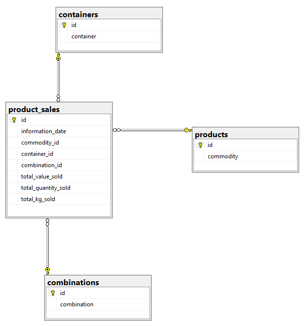

# Relational Database

Database normalization to star or snowflake format

## Layout

```bash
.
└── database-design
    ├── imgs
    │   └── data_model.PNG                  # image of resulting data model
    ├── resources
    │   ├── __init__.py
    │   └── extensions.py                   # initialize sqlalchemy
    ├── sql_scripts
    │   ├── delta_ingestion.sql             # normalizes only data that is not normalized in the database 
    │   └── initial_ingestion.sql           # initial ingestion where all the data was normalized at once
    ├── app.py                              # runs the code to normalize the data
    ├── dbconnector.py                      # connection details to a database
    ├── models.py                           # data models
    ├── README.md
    ├── requirements.txt
    └── utils.py                            # connects to a database
```

The relational database is created using using flask and flask-sqlalchemy.

```bash
pip install flask
pip install flask-sqlalchemy
```

The image below is what resulted from creating a model that generated the database.



The **product_sales** serves as a fact table with the design displayed below.

```python
class ProductSales(db.Model):
    __tablename__ = 'product_sales'

    id = db.Column(db.Integer, primary_key=True)
    information_date = db.Column(db.String(20))
    commodity_id = db.Column(db.Integer, db.ForeignKey('products.id'))
    container_id = db.Column(db.Integer, db.ForeignKey('containers.id'))
    combination_id = db.Column(db.Integer, db.ForeignKey('combinations.id'))
    total_value_sold = db.Column(db.Float)
    total_quantity_sold = db.Column(db.Integer)
    total_kg_sold = db.Column(db.Float)
```

An example of the a dimension table (**products**) created using flask-sqlalchemy. A similar format is followed for creating other dimension tables (**containers** and **product_combinations**)

```python
class Product(db.Model):
    __tablename__ = 'products'

    id = db.Column(db.Integer, primary_key=True)
    commodity = db.Column(db.String(50), unique=True)
    product_sales = db.relationship(
        'ProductSales', backref='products', lazy=True)
```
